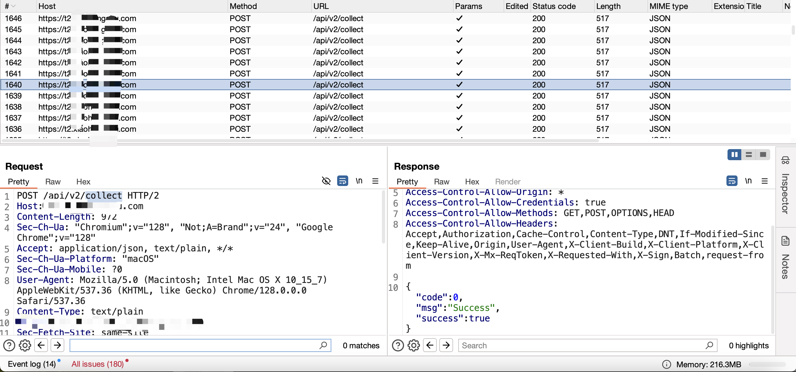

# URLblocker
在日常的渗透测试/SRC挖掘过程中，如果没有设置合理的Scope，那么BurpSuite Proxy默认会记录全量HTTP/S日志。这其中充斥着大量OPTIONS、API收集、缓存更新等rest请求。这些请求不仅会占用内存空间，还会增加HTTP History分析的复杂度



# How it Works
结合了以往使用BurpSuite的经验，大概有两种过滤HTTP HISTORY的思路：

1. 参考[filter-options](https://github.com/pajswigger/filter-options)的做法：设置URL黑名单机制，当请求的URL命中黑名单时，通过插件改变流量包响应的MIME值。例如，使其变为Content-Type: text/css，从而被HTTP History默认的规则过滤


2. 设置Scope/Excude From Scope，默认接受所有的HTTP流量，排除指定URL的流量


综上，第一种方案不仅要改变MIME，很多情况下还需要对Response Body进行修改，这是因为BurpSuite会根据Body推测MIME类型。而这一高危操作很可能使网站的正常功能受损，得不偿失。因此，URLBlcoker采用第二种方案

# How to use it
1. 使用mvn编译插件

```bash
mvn clean package
```

2. 安装BurpSuite插件：target/burp-url-blocker-1.0-SNAPSHOT-jar-with-dependencies.jar
3. 安装成功后，点击Burpsuite面板的「Target」⇒ 「Scope」，勾选「Use advanced scope control」，在Include in scope中增加一个选项，并设置除Protocol字段外的其余为空值，点击OK


4. 在任意的HTTP History中右键调用插件，随后的流量将不会记录在History中
